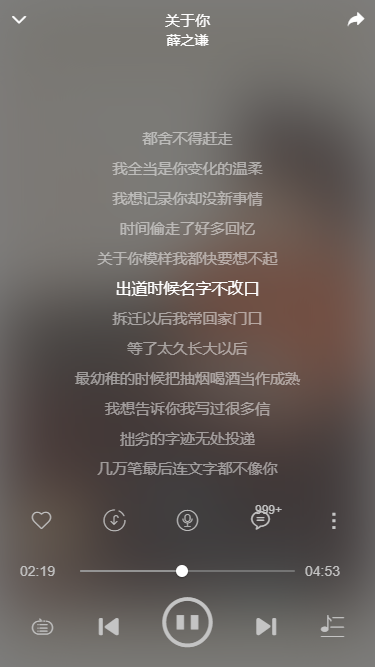

# vue3网易云音乐

## 项目架构

```bash
|-- vue3-music-netease
    |-- .browserslistrc
    |-- .eslintrc.js
    |-- .gitignore
    |-- babel.config.js
    |-- package-lock.json
    |-- package.json
    |-- postcss.config.js
    |-- README.md
    |-- tsconfig.json
    |-- vue.config.js
    |-- .idea
    |   |-- .gitignore
    |   |-- modules.xml
    |   |-- v3_ts_music.iml
    |   |-- vcs.xml
    |   |-- workspace.xml
    |   |-- inspectionProfiles
    |       |-- Project_Default.xml
    |-- public
    |   |-- favicon.ico
    |   |-- index.html
    |-- screenshot
    |   |-- boke.jpg
    |   |-- cloud.jpg
    |   |-- comment.jpg
    |   |-- conversation.jpg
    |   |-- dark01.jpg
    |   |-- dark02.jpg
    |   |-- dark03.jpg
    |   |-- days.jpg
    |   |-- digitAlbum.jpg
    |   |-- djdetail.jpg
    |   |-- event.jpg
    |   |-- guanzhu.jpg
    |   |-- history.jpg
    |   |-- home.jpg
    |   |-- login.jpg
    |   |-- lyric.jpg
    |   |-- mine.jpg
    |   |-- msg.jpg
    |   |-- player.jpg
    |   |-- sheetDetail.jpg
    |   |-- sheetSquare.jpg
    |   |-- sideMenu.jpg
    |   |-- singerDetail.jpg
    |   |-- singerlist.jpg
    |   |-- songComment.jpg
    |   |-- toplist.jpg
    |   |-- userInfo.jpg
    |-- src
        |-- App.vue
        |-- main.ts
        |-- permission.ts
        |-- shims-vue.d.ts
        |-- api
        |   |-- album.ts
        |   |-- comment.ts
        |   |-- dj.ts
        |   |-- event.ts
        |   |-- home.ts
        |   |-- msg.ts
        |   |-- recent.ts
        |   |-- search.ts
        |   |-- sheet.ts
        |   |-- singer.ts
        |   |-- song.ts
        |   |-- toplist.ts
        |   |-- user.ts
        |   |-- video.ts
        |-- assets
        |   |-- logo.png
        |   |-- iconfont
        |   |   |-- demo.css
        |   |   |-- demo_index.html
        |   |   |-- iconfont.css
        |   |   |-- iconfont.js
        |   |   |-- iconfont.json
        |   |   |-- iconfont.ttf
        |   |   |-- iconfont.woff
        |   |   |-- iconfont.woff2
        |   |-- images
        |   |   |-- player
        |   |   |   |-- disc-plus.png
        |   |   |   |-- disc.png
        |   |   |   |-- disc_default.png
        |   |   |   |-- disc_light-plus.png
        |   |   |   |-- loading.gif
        |   |   |   |-- needle-ab.png
        |   |   |-- public
        |   |       |-- active.gif
        |   |       |-- header.png
        |   |       |-- heijiao.png
        |   |       |-- logo.jpg
        |   |       |-- screen.jpg
        |   |-- styles
        |       |-- animate.css
        |       |-- global.less
        |       |-- mode.less
        |-- components
        |   |-- BigPlayer
        |   |   |-- index.vue
        |   |-- Comment
        |   |   |-- commentItem.vue
        |   |   |-- commentPopup.vue
        |   |-- DjItem
        |   |   |-- index.vue
        |   |-- EventCom
        |   |   |-- eventItem.vue
        |   |-- MiniPlayer
        |   |   |-- index.vue
        |   |-- msg
        |   |   |-- avatar.vue
        |   |   |-- conversationItem.vue
        |   |   |-- msgBubble.vue
        |   |   |-- msgItem.vue
        |   |   |-- sendBox.vue
        |   |   |-- messageElement
        |   |       |-- imgMsg.vue
        |   |       |-- listenTogether.vue
        |   |       |-- sheetMsg.vue
        |   |       |-- songMsg.vue
        |   |       |-- textMsg.vue
        |   |       |-- timeMsg.vue
        |   |-- MvItem
        |   |   |-- index.vue
        |   |-- mySheetList
        |   |   |-- index.vue
        |   |   |-- sheetItem.vue
        |   |-- NavBar
        |   |   |-- index.vue
        |   |-- PlayList
        |   |   |-- index.vue
        |   |   |-- listPopup.vue
        |   |-- Screen
        |   |   |-- index.vue
        |   |-- ScreenPoster
        |   |   |-- index.vue
        |   |-- Scroll
        |   |   |-- index.vue
        |   |   |-- scrollBanner.vue
        |   |-- ShareFriend
        |   |   |-- index.vue
        |   |-- SingerAlbumItem
        |   |   |-- index.vue
        |   |-- songItem
        |   |   |-- index.vue
        |   |   |-- songMenu.vue
        |   |-- songListItem
        |   |   |-- index.vue
        |   |-- UserItem
        |   |   |-- index.vue
        |   |-- VerifyCode
        |       |-- index.vue
        |-- layout
        |   |-- index.vue
        |   |-- miniplayout.vue
        |   |-- components
        |       |-- SideMenu.vue
        |       |-- TabBar.vue
        |-- libs
        |   |-- city.ts
        |-- router
        |   |-- index.ts
        |-- store
        |   |-- index.ts
        |   |-- msg.ts
        |   |-- player.ts
        |   |-- system.ts
        |   |-- user.ts
        |-- types
        |   |-- api
        |   |   |-- album.ts
        |   |   |-- comment.ts
        |   |   |-- dj.ts
        |   |   |-- event.ts
        |   |   |-- home.ts
        |   |   |-- msg.ts
        |   |   |-- recent.ts
        |   |   |-- search.ts
        |   |   |-- sheet.ts
        |   |   |-- singer.ts
        |   |   |-- song.ts
        |   |   |-- toplist.ts
        |   |   |-- user.ts
        |   |   |-- video.ts
        |   |-- public
        |   |   |-- album.ts
        |   |   |-- cloudDisk.ts
        |   |   |-- comment.ts
        |   |   |-- comprehensive.ts
        |   |   |-- dj.ts
        |   |   |-- event.ts
        |   |   |-- index.ts
        |   |   |-- msg.ts
        |   |   |-- mv.ts
        |   |   |-- radio.ts
        |   |   |-- sheet.ts
        |   |   |-- singer.ts
        |   |   |-- user.ts
        |   |   |-- video.ts
        |   |   |-- voice.ts
        |   |-- store
        |       |-- player.ts
        |-- utils
        |   |-- auth.ts
        |   |-- back.ts
        |   |-- decodeText.ts
        |   |-- dom.ts
        |   |-- emojiMap.ts
        |   |-- enum.ts
        |   |-- eventBus.ts
        |   |-- index.ts
        |   |-- mode.ts
        |   |-- request.ts
        |   |-- song.ts
        |-- vant
        |   |-- index.ts
        |-- views
            |-- album
            |   |-- detail.vue
            |   |-- index.vue
            |   |-- components
            |       |-- albumItem.vue
            |       |-- digitAlbum.vue
            |       |-- newAlbum.vue
            |       |-- sheetInfo.vue
            |       |-- singleDigit.vue
            |-- boke
            |   |-- djCategory.vue
            |   |-- djDetail.vue
            |   |-- index.vue
            |   |-- components
            |       |-- sheetInfo.vue
            |       |-- djCategory
            |       |   |-- djList.vue
            |       |-- listen
            |       |   |-- index.vue
            |       |   |-- popularItem.vue
            |       |   |-- topList.vue
            |       |   |-- topPopular.vue
            |       |-- story
            |       |   |-- index.vue
            |       |-- suggest
            |           |-- banner.vue
            |           |-- index.vue
            |           |-- recommend.vue
            |           |-- recommendItem.vue
            |-- conversation
            |   |-- index.vue
            |-- daysRecommend
            |   |-- history.vue
            |   |-- index.vue
            |   |-- components
            |       |-- dateList.vue
            |-- editSheet
            |   |-- editDesc.vue
            |   |-- editName.vue
            |   |-- editTag.vue
            |   |-- index.vue
            |-- fansFollows
            |   |-- index.vue
            |   |-- components
            |       |-- fans.vue
            |       |-- follows.vue
            |-- follow
            |   |-- index.vue
            |-- home
            |   |-- index.vue
            |   |-- components
            |       |-- menu.vue
            |       |-- newMv.vue
            |       |-- newSong.vue
            |       |-- newSongItem.vue
            |       |-- recommendSongList.vue
            |       |-- swiper.vue
            |-- likeList
            |   |-- index.vue
            |-- login
            |   |-- emailLogin.vue
            |   |-- index.vue
            |   |-- inputCode.vue
            |   |-- phoneLogin.vue
            |-- mine
            |   |-- cloudDisk.vue
            |   |-- index.vue
            |   |-- recentPlay.vue
            |   |-- components
            |       |-- collectSheet.vue
            |       |-- createPopup.vue
            |       |-- createSheet.vue
            |       |-- likeList.vue
            |       |-- popupMenu.vue
            |       |-- sheet.vue
            |       |-- sheetItem.vue
            |       |-- cloudDisk
            |       |   |-- cloudItem.vue
            |       |   |-- uploadMusic.vue
            |       |-- recentPlay
            |           |-- albumItem.vue
            |           |-- djItem.vue
            |           |-- recentAlbum.vue
            |           |-- recentDj.vue
            |           |-- recentSheet.vue
            |           |-- recentSong.vue
            |           |-- recentVideo.vue
            |           |-- recentVoice.vue
            |           |-- sheetItem.vue
            |           |-- videoItem.vue
            |           |-- voiceItem.vue
            |-- msg
            |   |-- index.vue
            |-- mv
            |   |-- index.vue
            |   |-- components
            |       |-- mvTop.vue
            |       |-- topMvItem.vue
            |-- search
            |   |-- index.vue
            |   |-- components
            |       |-- album.vue
            |       |-- albumItem.vue
            |       |-- comprehensive.vue
            |       |-- lyric.vue
            |       |-- lyricItem.vue
            |       |-- mv.vue
            |       |-- mvItem.vue
            |       |-- radioStation.vue
            |       |-- radioStationItem.vue
            |       |-- sheet.vue
            |       |-- singer.vue
            |       |-- single.vue
            |       |-- suggestResult.vue
            |       |-- user.vue
            |       |-- videoCom.vue
            |       |-- videoItem.vue
            |-- sheetSquare
            |   |-- index.vue
            |   |-- components
            |       |-- sheetItem.vue
            |       |-- sheetList.vue
            |-- singer
            |   |-- detail.vue
            |   |-- index.vue
            |   |-- songs.vue
            |   |-- components
            |       |-- singerItem.vue
            |-- songSheetDetail
            |   |-- index.vue
            |   |-- components
            |       |-- sheetInfo.vue
            |-- topList
            |   |-- index.vue
            |   |-- components
            |       |-- topItem.vue
            |-- userInfo
            |   |-- index.vue
            |   |-- components
            |       |-- collectSheet.vue
            |       |-- createSheet.vue
            |       |-- eventList.vue
            |       |-- musicTaste.vue
            |-- videoDetail
            |   |-- index.vue
            |   |-- components
            |       |-- playVideo.vue
            |-- village
                |-- index.vue

```

## 介绍

网易云音乐项目, 使用了网易云 Api, 实现了网易云音乐的大部分功能, 包括歌曲、歌单、mv、电台、排行榜等。

## 实现功能

1. 邮箱登录、手机号登录
2. 首页
3. 歌单详情
4. 跟手详情
5. 歌曲播放
6. 个人中心
7. 用户详情
8. 关注和粉丝
9. 歌曲播放
10. 电台播放
11. 消息发送
12. 歌曲、歌单分享好友
13. 歌词滚动
14. 搜索
15. mv播放
16. 夜间模式
17. 云盘音乐上传
18. 最近播放
19. 歌单创建、编辑

## 项目截图

### 登录

### 首页

### 每日推荐

### 历史日推

### 歌单广场

### 排行榜

### 排行榜详情、歌单详情

### 歌单评论

### 歌手列表

### 歌手详情

### 数字专辑

### 播客（电台）

### 电台详情

### 个人中心

### 关注和粉丝

### 云盘

### 用户中心

### 朋友圈

### 侧边菜单

### 聊天会话

### 聊天界面

### 歌曲播放

### 歌曲评论

### 歌词滚动

### 夜间模式


### 歌词滚动


## 接口地址项目 https://github.com/Binaryify/NeteaseCloudMusicApi

## Project setup

```bash
npm install
```

### Compiles and hot-reloads for development

```bash
npm run serve
```

### Compiles and minifies for production

```bash
npm run build
```

### Lints and fixes files

```bash
npm run lint
```
